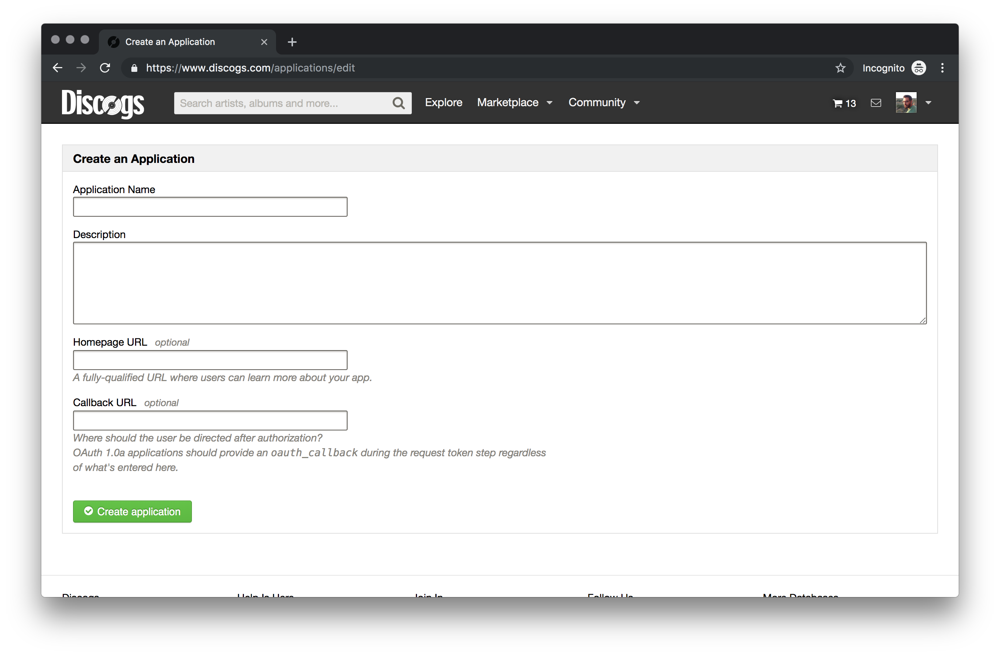
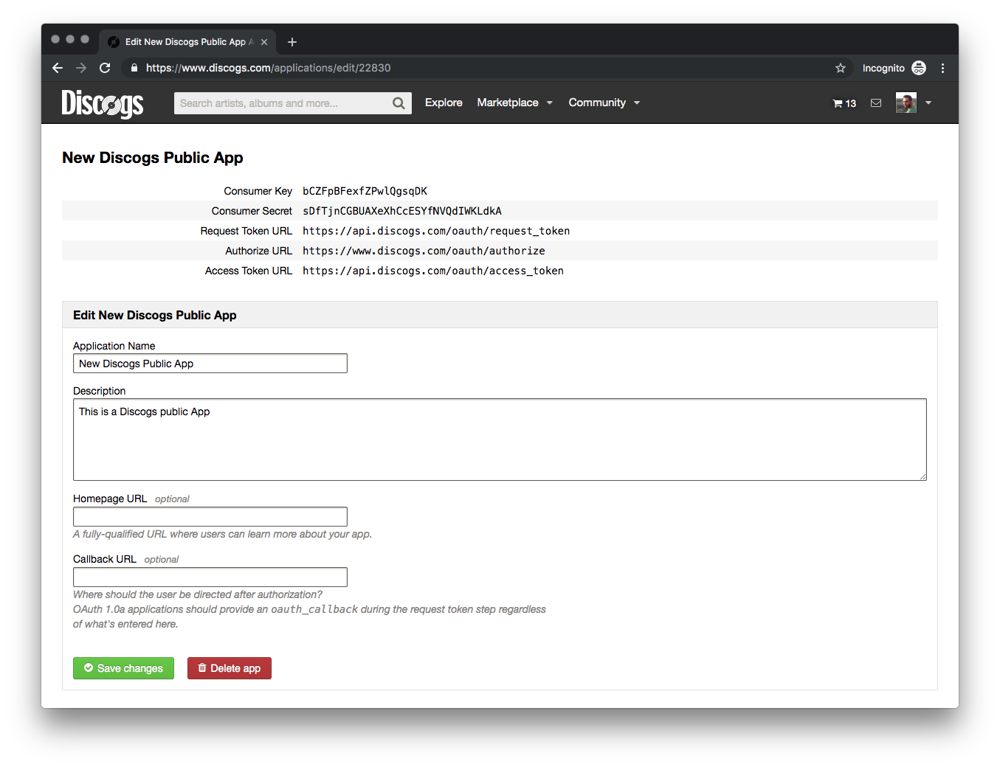
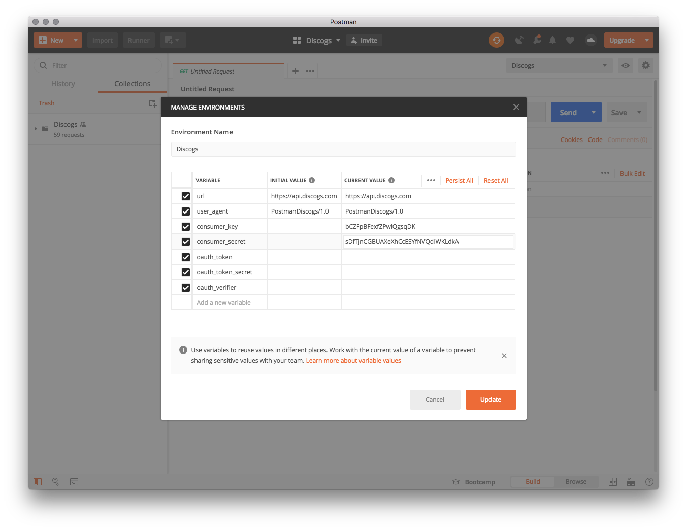
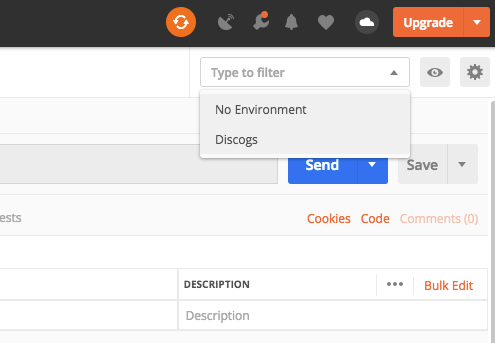
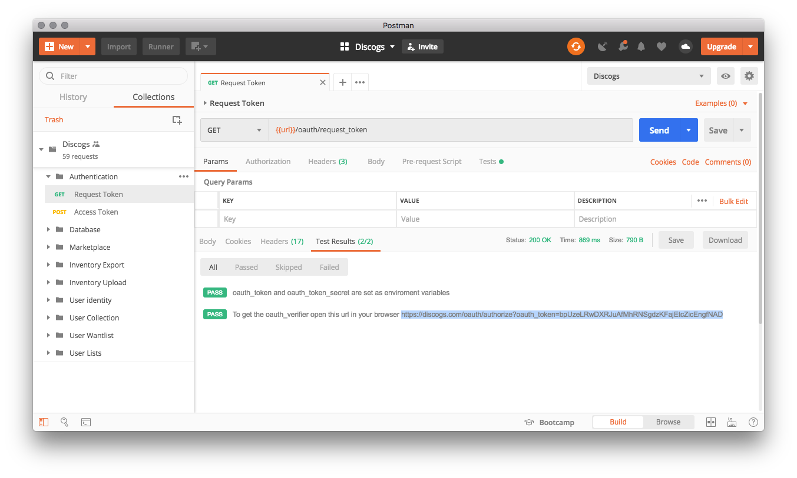
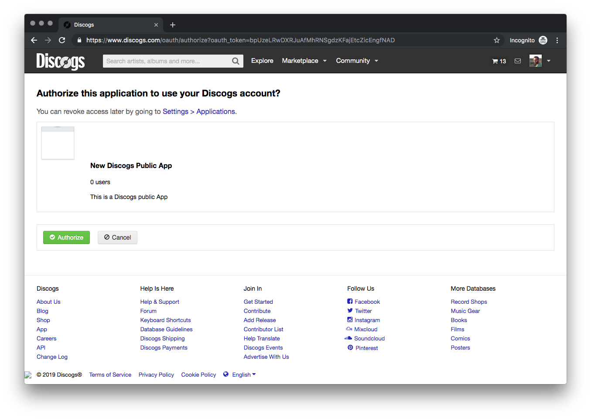
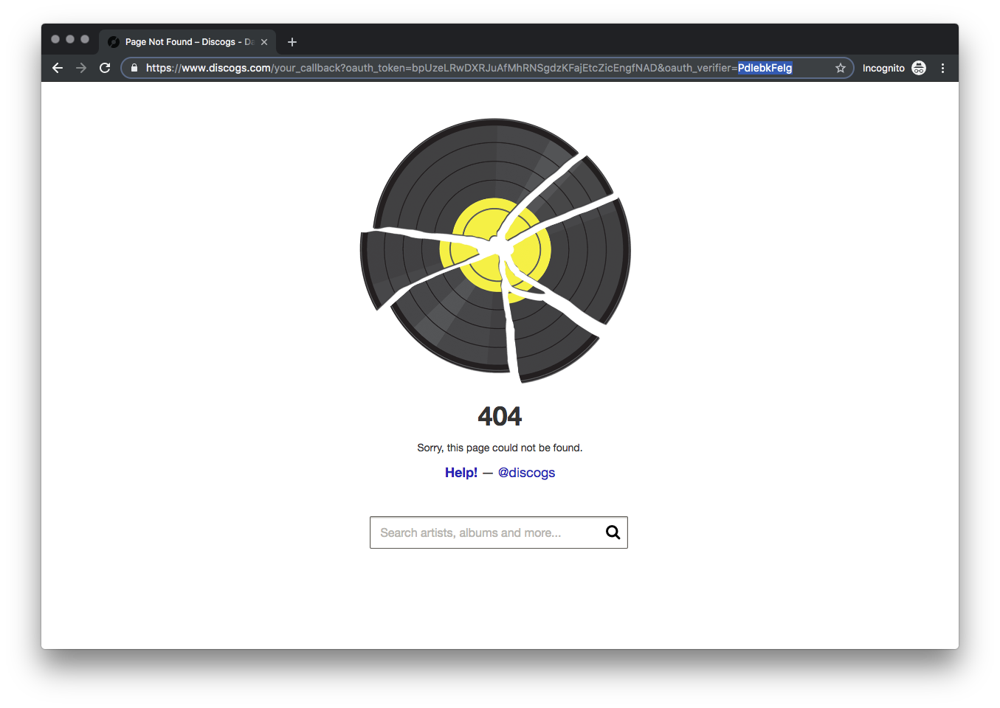
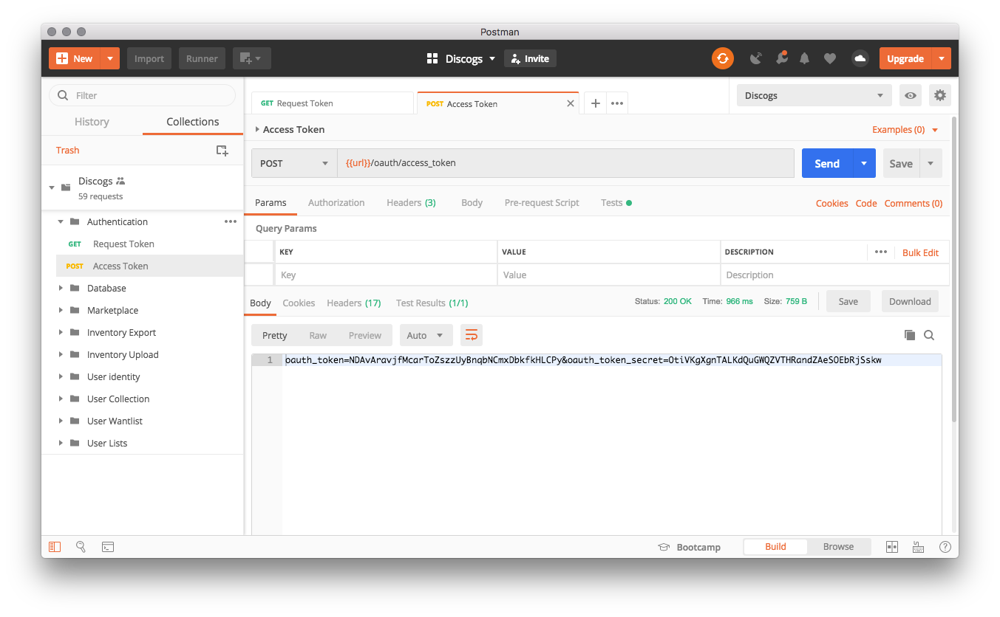

# Discogs Postman

A Postman collection for Discogs public API.

## Steps to get up and running

Follow these steps to quickly get up and running with the Discogs public API and Postman:

### 1. Import the Discogs collection and environment into Postman

Download or clone this repository and import the collection and environment files.

You can choose between version 2.0 and 2.1.

### 2. Create a public app at https://www.discogs.com/settings/developers

Go to the Discogs developer portal and create a public app.

### 3. Add your consumer key and consumer secret to the Discogs environment variables in Postman

Copy the consumer key and consumer secret of your app into the `consumer_key` and `consumer_secret` environment variables in Postman.

### 4. Select the Discogs environment

Select Discogs from the environment drop-down menu in Postman

### 5. Get your request token

Open the Authentication folder and send GET Request Token call in Postman.

Inside the response section, go to the Test Results tab and copy the authorization URL.

### 6. Get your OAuth verifier

Paste the authorization URL into your browser, log in to Discogs and authorize the application.

If the application doesn't have a valid callback URL, you will be redirected to a 404 page. You find the `oauth_verifier` as the last parameter of the webpage URL, copy the value and paste it into the `oauth_verifier` environment variable in Postman.

### 7. Get your access token

Open the Authentication folder and send POST Access Token call in Postman.

Congrats! You're now authenticated and can start making API calls.

### 8. Make your first API call!

Open the User identity folder and click Send on the GET Identity request to make your first API call. Additionally, copy and paste the `username` environment variables in Postman.

## Discogs public API documentation

You find more information regarding Discogs public APIs [here](https://www.discogs.com/developers/).

## Contributing

Contributions are very welcome:
if you spot any bug, open a new issue or pull request.

## Licence

MIT
